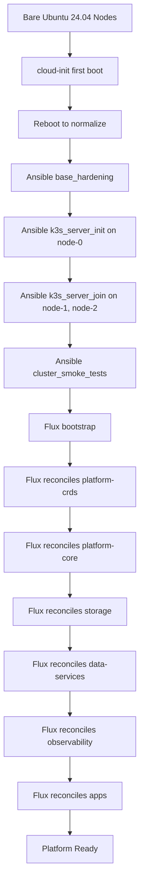
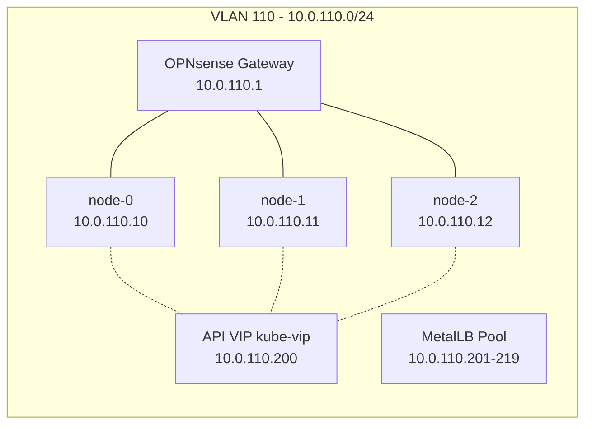
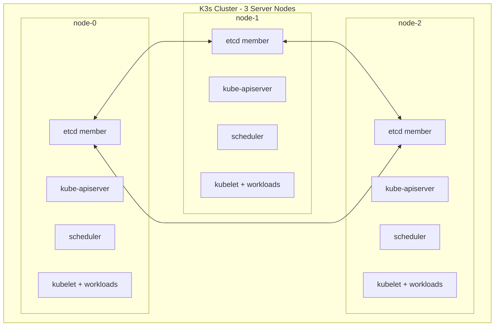
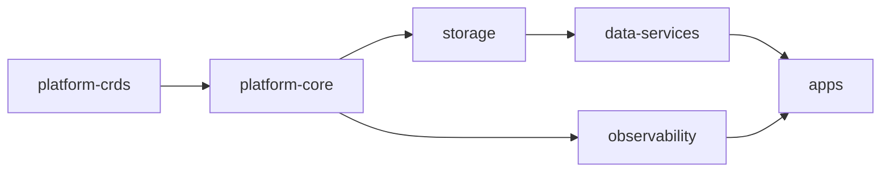

# Design Document: k3s Homelab Platform

## Overview

This design describes a reproducible 3-node HA Kubernetes platform built on k3s with embedded etcd. The architecture follows a three-layer bootstrap model:

1. **cloud-init** handles first-boot OS baseline (hostname, users, kernel, packages)
2. **Ansible** handles OS hardening, k3s installation, cluster formation, and validation
3. **Flux CD** handles all in-cluster resource delivery via GitOps

The platform targets the three `node-{0,1,2}` machines on VLAN 110 (`10.0.110.0/24`), each with Intel i5-10600T, 16 GiB RAM, and NVMe storage (512/256/128 GB respectively). All post-bootstrap cluster state flows through Git.

### Design Decisions

| Decision | Choice | Rationale |
|---|---|---|
| k3s distribution | k3s with embedded etcd | Lightweight, single-binary, built-in HA with 3 servers |
| API HA endpoint | kube-vip (static pod, L2 mode) | Floating VIP for API server; avoids SPOF on node-0; works pre-MetalLB |
| CNI | Flannel (k3s default) | Simple, proven, sufficient for homelab scale |
| GitOps controller | Flux CD v2 | Native Kustomization support, dependency ordering, health checks |
| Load balancer | MetalLB (L2 mode) | Only viable bare-metal LB; L2 mode fits single-subnet topology |
| Ingress | ingress-nginx | Mature, well-documented, broad community support |
| TLS management | cert-manager with internal CA | Self-signed CA is appropriate for `.arpa` internal domain |
| Block storage | Longhorn | Distributed replicated storage, built-in backup/snapshot, k3s-native |
| Database operator | CloudNativePG | Kubernetes-native PostgreSQL with HA failover and WAL archiving |
| Object storage | MinIO (distributed mode) | S3-compatible, runs on Kubernetes, suitable for backup targets |
| Observability | kube-prometheus-stack + Loki | Prometheus/Grafana/Alertmanager bundle + Loki for logs |
| Secret management | SOPS with age encryption | Git-friendly encryption, no external secret store dependency |
| Message broker | Redis (Sentinel mode) | Lightweight, multi-purpose (cache, pub/sub, queue) |

## Architecture

### Bootstrap Flow



### Network Topology



### Cluster Architecture



### Flux Kustomization Dependency Chain



## Components and Interfaces

### Layer 1: Cloud-Init

Each node gets a dedicated cloud-init YAML file (`bootstrap/cloud-init/node-{0,1,2}.yaml`). All three share identical configuration except for hostname/FQDN.

**Responsibilities:**
- Set hostname and FQDN (`node-{N}.cluster.arpa`)
- Create admin user `kadmin` with SSH public key
- Disable swap (fstab + runtime)
- Install packages: `curl`, `jq`, `nfs-common`, `open-iscsi`, `qemu-guest-agent`
- Load kernel modules: `overlay`, `br_netfilter`, `iscsi_tcp`
- Apply sysctls: `net.bridge.bridge-nf-call-iptables=1`, `net.bridge.bridge-nf-call-ip6tables=1`, `net.ipv4.ip_forward=1`
- Enable `systemd-timesyncd`
- Final reboot

**Interface:** cloud-init YAML consumed by the Ubuntu installer or cloud-init datasource.

### Layer 2: Ansible

**Directory structure:**
```
bootstrap/ansible/
├── ansible.cfg
├── inventory/
│   ├── hosts.yaml
│   └── group_vars/
│       └── k3s_servers.yaml
├── roles/
│   ├── base_hardening/
│   ├── k3s_server_init/
│   ├── k3s_server_join/
│   ├── kubeconfig_export/
│   ├── cluster_smoke_tests/
│   └── node_cleanup/
├── site.yaml
├── validate.yaml
└── cleanup.yaml
```

**Roles:**

| Role | Target | Purpose |
|---|---|---|
| `base_hardening` | All nodes | Idempotent OS state verification and hardening |
| `k3s_server_init` | node-0 | Install k3s as first server with embedded etcd; deploy kube-vip static pod for API VIP |
| `k3s_server_join` | node-1, node-2 | Join as additional k3s servers |
| `kubeconfig_export` | node-0 | Retrieve and rewrite kubeconfig |
| `cluster_smoke_tests` | localhost | Validate cluster health |
| `node_cleanup` | Target node(s) | Reset node to pre-bootstrap state |

**Variables schema (group_vars/k3s_servers.yaml):**
```yaml
cluster_name: homelab-k3s
k3s_version: "v1.31.4+k3s1"  # pinned
k3s_token: "{{ vault_k3s_token }}"
api_server_vip: "10.0.110.200"
api_server_port: 6443
disable_components:
  - traefik
  - servicelb
admin_user: kadmin
kube_vip_version: "v0.8.7"
metallb_pool_start: "10.0.110.201"
metallb_pool_end: "10.0.110.219"

# Primary backup target (off-cluster NAS/S3 — optional, warns if empty)
backup_s3_endpoint: ""       # e.g., "https://nas.lan:9000"
backup_bucket: ""
backup_secret_ref: ""

# Optional in-cluster MinIO (secondary cache only, disabled by default)
minio_enabled: false
```

> **Note:** `api_server_vip` is `10.0.110.200`, managed by kube-vip as a floating VIP. MetalLB pool starts at `.201` to avoid conflict. Primary backups target the off-cluster S3 endpoint when configured. If `backup_s3_endpoint` is empty, Ansible emits a warning and skips backup job creation. In-cluster MinIO is an optional secondary cache.

**Playbook execution order:**
1. `ansible-playbook site.yaml --limit node-0` (init first server)
2. `ansible-playbook site.yaml --limit node-1,node-2` (join remaining)
3. `ansible-playbook validate.yaml` (smoke tests)

**Cleanup playbook:**
- `ansible-playbook cleanup.yaml --limit <target-nodes>`
- Executes `node_cleanup` role: stops k3s, runs k3s-uninstall, removes CNI/container artifacts, cleans Longhorn mounts/devices, reverts kernel modules and sysctls

### Layer 3: Flux CD GitOps

**Directory structure:**
```
gitops/
├── clusters/
│   └── homelab-k3s/
│       ├── flux-system/          # Flux bootstrap manifests
│       ├── platform-crds.yaml    # Kustomization: CRD installs
│       ├── platform-core.yaml    # Kustomization: core services
│       ├── storage.yaml          # Kustomization: Longhorn
│       ├── data-services.yaml    # Kustomization: CNPG, Redis, (optional MinIO)
│       ├── observability.yaml    # Kustomization: monitoring + logging
│       └── apps.yaml             # Kustomization: agentic + custom
├── infrastructure/
│   ├── metallb/
│   ├── ingress-nginx/
│   ├── cert-manager/
│   └── network-policies/
├── data-services/
│   ├── cloudnative-pg/
│   ├── minio/                    # Optional — gated by minio_enabled
│   └── redis/
└── apps/
    ├── agentic/
    └── custom/
```

**Kustomization ordering and health checks:**

| Kustomization | dependsOn | Path | Interval |
|---|---|---|---|
| `platform-crds` | — | `gitops/infrastructure/crds` | 10m |
| `platform-core` | `platform-crds` | `gitops/infrastructure/` | 10m |
| `storage` | `platform-core` | `gitops/infrastructure/longhorn` | 10m |
| `observability` | `platform-core` | `gitops/infrastructure/observability` | 10m |
| `data-services` | `storage` | `gitops/data-services/` | 10m |
| `apps` | `data-services`, `observability` | `gitops/apps/` | 5m |

Each Kustomization uses `healthChecks` to gate downstream dependencies.

### Layer 4: Platform Services

**kube-vip (static pod):**
- Floating VIP `10.0.110.200` for the Kubernetes API server
- Deployed as a static pod on all server nodes during k3s bootstrap (pre-Flux)
- L2/ARP mode — leader election among the 3 nodes
- If the node holding the VIP goes down, another node takes over within seconds
- k3s is configured with `--tls-san=10.0.110.200` so the API cert covers the VIP

**MetalLB:**
- IPAddressPool: `10.0.110.201-10.0.110.219` (`.200` reserved for kube-vip API VIP)
- L2Advertisement: advertise on all nodes
- Deployed via Flux HelmRelease

**ingress-nginx:**
- LoadBalancer service with MetalLB-assigned IP (e.g., `10.0.110.201`)
- Default IngressClass
- Deployed via Flux HelmRelease

**cert-manager:**
- Internal CA: self-signed root CA → ClusterIssuer `internal-ca`
- Wildcard Certificate for `*.cluster.arpa`
- Deployed via Flux HelmRelease

**Network Policies:**
- Default deny ingress per namespace
- Allow ingress from ingress-nginx namespace
- Allow intra-namespace communication
- Allow kube-system and monitoring access

### SOPS/age Secret Management Bootstrap

**Bootstrap sequence for Flux decryption:**

1. **Pre-bootstrap (operator workstation):**
   - Generate age keypair: `age-keygen -o age.key`
   - Store `age.key` securely (1Password, offline backup)
   - Extract public key for `.sops.yaml` config

2. **Ansible creates the decryption secret:**
   - After k3s is up but before Flux bootstrap, Ansible creates a Kubernetes secret in `flux-system` namespace:
     ```
     kubectl create secret generic sops-age --namespace=flux-system --from-file=age.agekey=age.key
     ```
   - This secret is referenced by Flux Kustomizations via `spec.decryption`

3. **Flux Kustomization decryption config:**
   ```yaml
   spec:
     decryption:
       provider: sops
       secretRef:
         name: sops-age
   ```

4. **Encrypting secrets in the repo:**
   - `.sops.yaml` at repo root defines encryption rules per path
   - Secrets encrypted with `sops --encrypt --age <public-key>` before commit
   - Flux decrypts at reconciliation time using the age key secret

5. **Key rotation:**
   - Generate new age keypair
   - Re-encrypt all secrets with new public key: `sops updatekeys`
   - Update the `sops-age` secret in cluster via Ansible
   - Rotation frequency: annually or on suspected compromise

### Layer 5: Storage

**Longhorn:**
- Default StorageClass: `longhorn` (replicas=2) — for general workloads
- Critical StorageClass: `longhorn-critical` (replicas=3) — for databases, brokers, object store metadata
- **Namespace-level enforcement**: `data-system` namespace annotated to default to `longhorn-critical`; `agentic-tools` and `apps` namespaces default to `longhorn`
- Recurring jobs: daily snapshots (retain 7), weekly backups to **off-cluster NAS/S3** target (when configured; skipped with warning if backup target is empty)
- UI exposed via ingress at `longhorn.cluster.arpa`
- **Disk capacity guardrails**:
  - Node labels: `storage-tier=large` (node-0, 512GB), `storage-tier=medium` (node-1, 256GB), `storage-tier=small` (node-2, 128GB)
  - Longhorn disk reservation threshold: 25% (prevents scheduling when disk is >75% full)
  - Longhorn node scheduling: prefer `storage-tier=large` and `storage-tier=medium` for replica placement
  - Alertmanager rule: fire warning at 70% disk usage per node

### Layer 6: Data Services

**CloudNativePG:**
- Namespace: `data-system`
- 3-instance PostgreSQL cluster (1 primary + 2 replicas)
- StorageClass: `longhorn-critical` (replicas=3)
- Scheduled backups: daily base backup + continuous WAL archiving to **off-cluster NAS/S3** (when configured)
- Automatic failover on primary failure
- **Placement**: pod anti-affinity ensures instances spread across nodes; prefer `storage-tier=large` and `storage-tier=medium` nodes

**MinIO:**
- Namespace: `data-system`
- **Distributed mode: 3 servers × 2 volumes each (6 total drives)** using Longhorn PVCs
- StorageClass: `longhorn-critical` (replicas=3) for MinIO volumes
- Erasure coding: tolerates loss of up to 2 drives (or 1 full node)
- **Optional — disabled by default** (`minio_enabled: false` in Ansible vars)
- Role: secondary S3 cache for in-cluster consumers only
- **Primary backups (Longhorn, CNPG) MUST target off-cluster NAS/S3** via `backup_s3_endpoint`
- Ingress (when enabled): `s3.cluster.arpa` (API), `minio.cluster.arpa` (console)
- **Placement**: StatefulSet with pod anti-affinity to spread across nodes; volume size capped to fit smallest node

**Redis:**
- Namespace: `data-system`
- Sentinel mode for HA
- Used as shared cache/message broker for agentic and custom apps

### Layer 7: Application Foundation

**Namespaces:**
- `agentic-tools`: for agentic AI workloads
- `apps`: for custom applications

**Workload profiles (enforced via Kustomize patches or OPA/Kyverno):**

| Profile | CPU req/limit | Memory req/limit | Probes | PDB minAvailable |
|---|---|---|---|---|
| `agentic-realtime` | 250m/1000m | 256Mi/1Gi | liveness+readiness | 1 |
| `agentic-batch` | 100m/2000m | 128Mi/2Gi | liveness only | 0 |
| `custom-app` | 100m/500m | 128Mi/512Mi | liveness+readiness | 1 |

**Shared templates:**
- Ingress template with cert-manager annotation for `*.cluster.arpa`
- Certificate template referencing `internal-ca` ClusterIssuer
- ExternalSecret or SealedSecret template for secret sync

### Layer 8: Observability

**kube-prometheus-stack (Helm):**
- Prometheus: scrape all namespaces, 15d retention
- Alertmanager: basic alerting rules (node down, pod crash, disk pressure)
- Grafana: dashboards for cluster, nodes, namespaces, Longhorn, CNPG
- Ingress: `grafana.cluster.arpa`, `prometheus.cluster.arpa`

**Loki + Promtail:**
- Centralized log aggregation from all pods
- 7d retention
- Integrated into Grafana as datasource

### Node Cleanup Component

**cleanup.yaml playbook** invokes the `node_cleanup` role with a configurable `cleanup_mode` variable:

**Modes:**
- `safe` (default): Stops k3s, removes k3s binaries and config, cleans CNI config. Does NOT touch Longhorn data, containerd images, or iptables. Safe for re-join scenarios.
- `full`: Complete reset to pre-bootstrap state. Removes everything including Longhorn volumes, containerd data, iptables rules, kernel module configs, and sysctl overrides. Requires explicit confirmation via `--extra-vars "confirm_full_cleanup=yes"`.

**Full mode steps:**

1. Stop k3s service (`k3s-killall.sh` if available)
2. Run k3s uninstall script (`/usr/local/bin/k3s-uninstall.sh`)
3. Remove residual directories: `/etc/rancher`, `/var/lib/rancher`, `/var/lib/kubelet`
4. Remove CNI config: `/etc/cni/`, `/var/lib/cni/`
5. *(full only)* Remove Longhorn data: `/var/lib/longhorn`
6. *(full only)* Remove container runtime artifacts: `/var/lib/containerd/`
7. *(full only)* Clean up iptables rules and IPVS tables
8. *(full only)* Unload kernel modules: `overlay`, `br_netfilter`, `iscsi_tcp`
9. *(full only)* Remove sysctl overrides from `/etc/sysctl.d/`
10. *(full only)* Remove module load configs from `/etc/modules-load.d/`
11. Optionally reboot

The role is idempotent — each step checks for existence before acting. Full mode requires `confirm_full_cleanup=yes` or the playbook aborts with an error message.

## Data Models

### Cloud-Init YAML Schema (per node)

```yaml
#cloud-config
hostname: "node-N"
fqdn: "node-N.cluster.arpa"
manage_etc_hosts: true

users:
  - name: kadmin
    groups: [sudo]
    shell: /bin/bash
    sudo: ALL=(ALL) NOPASSWD:ALL
    ssh_authorized_keys:
      - "ssh-ed25519 AAAA..."

package_update: true
packages:
  - curl
  - jq
  - nfs-common
  - open-iscsi
  - qemu-guest-agent

write_files:
  - path: /etc/modules-load.d/k8s.conf
    content: |
      overlay
      br_netfilter
      iscsi_tcp
  - path: /etc/sysctl.d/k8s.conf
    content: |
      net.bridge.bridge-nf-call-iptables=1
      net.bridge.bridge-nf-call-ip6tables=1
      net.ipv4.ip_forward=1

runcmd:
  - modprobe overlay
  - modprobe br_netfilter
  - modprobe iscsi_tcp
  - sysctl --system
  - swapoff -a
  - sed -i '/swap/d' /etc/fstab
  - systemctl enable --now systemd-timesyncd

power_state:
  mode: reboot
  message: "cloud-init complete, rebooting"
  condition: true
```

### Ansible Inventory Schema

```yaml
all:
  children:
    k3s_servers:
      hosts:
        node-0:
          ansible_host: 10.0.110.10
          node_fqdn: node-0.cluster.arpa
          k3s_role: init
        node-1:
          ansible_host: 10.0.110.11
          node_fqdn: node-1.cluster.arpa
          k3s_role: join
        node-2:
          ansible_host: 10.0.110.12
          node_fqdn: node-2.cluster.arpa
          k3s_role: join
```

### Ansible Variables Schema

```yaml
# group_vars/k3s_servers.yaml
cluster_name: homelab-k3s
k3s_version: "v1.31.4+k3s1"
k3s_token: "{{ vault_k3s_token }}"
api_server_vip: "10.0.110.200"
api_server_port: 6443
disable_components:
  - traefik
  - servicelb
admin_user: kadmin
kube_vip_version: "v0.8.7"
metallb_pool_start: "10.0.110.201"
metallb_pool_end: "10.0.110.219"

# Primary backup target (off-cluster NAS/S3 — required)
backup_s3_endpoint: ""
backup_bucket: ""
backup_secret_ref: ""

# Optional in-cluster MinIO (secondary cache only)
minio_enabled: false
```

### Flux Kustomization Schema

```yaml
apiVersion: kustomize.toolkit.fluxcd.io/v1
kind: Kustomization
metadata:
  name: <layer-name>
  namespace: flux-system
spec:
  interval: 10m
  sourceRef:
    kind: GitRepository
    name: flux-system
  path: <gitops-path>
  prune: true
  wait: true
  dependsOn:
    - name: <dependency>
  healthChecks:
    - apiVersion: apps/v1
      kind: Deployment
      name: <deployment>
      namespace: <namespace>
```

### MetalLB Address Pool Schema

```yaml
apiVersion: metallb.io/v1beta1
kind: IPAddressPool
metadata:
  name: homelab-pool
  namespace: metallb-system
spec:
  addresses:
    - 10.0.110.201-10.0.110.219
---
apiVersion: metallb.io/v1beta1
kind: L2Advertisement
metadata:
  name: homelab-l2
  namespace: metallb-system
spec:
  ipAddressPools:
    - homelab-pool
```

### Longhorn StorageClass Schema

```yaml
apiVersion: storage.k8s.io/v1
kind: StorageClass
metadata:
  name: longhorn
  annotations:
    storageclass.kubernetes.io/is-default-class: "true"
provisioner: driver.longhorn.io
parameters:
  numberOfReplicas: "2"
  staleReplicaTimeout: "2880"
reclaimPolicy: Delete
volumeBindingMode: Immediate
---
apiVersion: storage.k8s.io/v1
kind: StorageClass
metadata:
  name: longhorn-critical
provisioner: driver.longhorn.io
parameters:
  numberOfReplicas: "3"
  staleReplicaTimeout: "2880"
reclaimPolicy: Retain
volumeBindingMode: Immediate
```


## Correctness Properties

*A property is a characteristic or behavior that should hold true across all valid executions of a system — essentially, a formal statement about what the system should do. Properties serve as the bridge between human-readable specifications and machine-verifiable correctness guarantees.*

The following properties are derived from the acceptance criteria prework analysis. Each property is universally quantified and references the requirements it validates.

### Property 1: Cloud-init configuration completeness

*For any* valid node index (0, 1, 2), the generated cloud-init YAML SHALL contain: a hostname matching `node-{N}.cluster.arpa`, a non-root admin user with SSH key, the required baseline packages (`curl`, `jq`, `nfs-common`, `open-iscsi`), the required kernel modules (`overlay`, `br_netfilter`, `iscsi_tcp`) in both write_files and runcmd, the required sysctl settings (`bridge-nf-call-iptables`, `bridge-nf-call-ip6tables`, `ip_forward`) in write_files, and a power_state reboot directive.

**Validates: Requirements 1.1, 1.2, 1.4, 1.5, 1.6**

### Property 2: Ansible inventory maps all nodes correctly

*For any* node in the set {node-0, node-1, node-2}, the Ansible inventory SHALL contain a host entry with the correct fixed IP address (`10.0.110.{10,11,12}` respectively), the correct FQDN (`node-{0,1,2}.cluster.arpa`), and a k3s role assignment (`init` for node-0, `join` for node-1 and node-2).

**Validates: Requirements 2.1**

### Property 3: k3s install flags are correct for each role

*For any* node with role `init`, the generated k3s install command SHALL include the pinned version, `--cluster-init` flag, and disable flags for `traefik` and `servicelb`. *For any* node with role `join`, the generated k3s install command SHALL include the pinned version, the server URL pointing to the init node, the cluster token, and the same disable flags.

**Validates: Requirements 2.3, 2.4**

### Property 4: Kubeconfig endpoint rewrite

*For any* kubeconfig retrieved from a k3s node, rewriting the API server endpoint to the target address and then parsing the result SHALL produce a valid kubeconfig with the server field matching the target address and port.

**Validates: Requirements 2.5**

### Property 5: Flux Kustomization dependency chain and health configuration

*For all* Flux Kustomization manifests in the gitops directory, each Kustomization SHALL have a `dependsOn` field consistent with the defined DAG: `platform-crds` has no dependencies, `platform-core` depends on `platform-crds`, `storage` and `observability` each depend on `platform-core`, `data-services` depends on `storage`, and `apps` depends on both `data-services` and `observability`. Each Kustomization SHALL also have a non-empty `interval` field and either a `healthChecks` list or `wait: true`.

**Validates: Requirements 3.2, 3.3**

### Property 6: Workload profile completeness

*For all* defined workload profiles (`agentic-realtime`, `agentic-batch`, `custom-app`), each profile SHALL specify CPU requests and limits, memory requests and limits, at least one probe configuration (liveness), and a PodDisruptionBudget `minAvailable` value.

**Validates: Requirements 6.3**

### Property 7: Repository structure completeness

*For any* complete platform repository, the directory tree SHALL contain: `bootstrap/cloud-init/` with one YAML file per node, `bootstrap/ansible/` with inventory, roles, and playbook files, and `gitops/` with subdirectories for `clusters/homelab-k3s/`, `infrastructure/`, `data-services/`, `apps/agentic/`, and `apps/custom/`.

**Validates: Requirements 9.2, 10.1**

### Property 8: Ansible variables schema completeness

*For any* Ansible group_vars file for the k3s_servers group, the file SHALL contain all required keys: `cluster_name`, `k3s_version`, `k3s_token`, `api_server_vip`, `api_server_port`, `disable_components`, `admin_user`, `kube_vip_version`, `metallb_pool_start`, `metallb_pool_end`, `backup_s3_endpoint`, `backup_bucket`, `backup_secret_ref`, and `minio_enabled`.

**Validates: Requirements 10.2**

### Property 9: Cleanup reverts bootstrap kernel/sysctl configuration (round-trip)

*For any* node where cloud-init has applied kernel module configs (in `/etc/modules-load.d/`) and sysctl configs (in `/etc/sysctl.d/`), executing the cleanup role SHALL remove those specific config files, such that the set of platform-created config files after cleanup is empty.

**Validates: Requirements 11.4**

## Error Handling

### Cloud-Init Failures

- If package installation fails during cloud-init, the node will still reboot but will be in an incomplete state. The Ansible `base_hardening` role detects and remediates missing packages.
- If kernel module loading fails, the sysctl settings that depend on `br_netfilter` will fail silently. The Ansible hardening role validates module state.

### Ansible Failures

- If k3s installation fails on node-0, the playbook aborts. The operator re-runs after investigating. k3s install is idempotent.
- If a join node fails to connect to the init node, Ansible retries with configurable retry count and delay.
- If kubeconfig retrieval fails, the playbook reports the error. The operator can manually retrieve from `/etc/rancher/k3s/k3s.yaml`.
- If smoke tests fail, the playbook exits with a clear error message indicating which check failed (node readiness, DNS, or workload status).

### Flux Reconciliation Failures

- If a Kustomization fails health checks, Flux marks it as `Not Ready` and does not proceed to dependent Kustomizations. The operator is alerted via Alertmanager.
- If the Git source is unreachable, Flux retries at the configured interval. Existing cluster state is preserved.
- If a HelmRelease fails to install, Flux retries with exponential backoff. The operator can inspect via `flux get helmreleases`.

### Storage Failures

- If Longhorn cannot maintain the configured replica count (e.g., only 2 nodes available for a 3-replica volume), it degrades gracefully and rebuilds when the node returns.
- If backup jobs fail, Longhorn and CNPG emit events and metrics that trigger Alertmanager notifications.

### Data Service Failures

- CloudNativePG automatic failover promotes a replica within seconds. If no replica is available, the cluster enters a degraded state and alerts fire.
- MinIO distributed mode (3×2): tolerates loss of 1 node (2 drives). If 2 nodes go down (4 drives lost), MinIO enters read-only or unavailable state. Primary backups are unaffected since they target off-cluster storage.

### Cleanup Failures

- If k3s-uninstall.sh is not found (k3s not installed), the cleanup role skips that step without error.
- Each cleanup task uses conditional checks (`when`, `ignore_errors` for non-critical steps) to ensure idempotency.
- If Longhorn volumes are still mounted, the cleanup role attempts unmount before directory removal.

## Testing Strategy

### Dual Testing Approach

This platform uses both unit/structural tests and property-based tests:

- **Unit/structural tests**: Validate specific manifest examples, edge cases, and error conditions
- **Property-based tests**: Validate universal properties across generated inputs (e.g., all node indices, all Kustomization files)

### Property-Based Testing Configuration

- **Library**: Python `hypothesis` (for validating YAML generation and structural properties)
- **Minimum iterations**: 100 per property test
- **Tag format**: `Feature: k3s-homelab-platform, Property {N}: {title}`

### Test Categories

**1. Cloud-Init Validation Tests**
- Property test: cloud-init completeness across all node indices (Property 1)
- Unit tests: validate specific YAML syntax, edge cases for hostname patterns

**2. Ansible Artifact Tests**
- Property test: inventory correctness (Property 2)
- Property test: k3s install flags per role (Property 3)
- Property test: kubeconfig rewrite (Property 4)
- Property test: variables schema completeness (Property 8)
- Unit tests: validate specific role task structure

**3. Flux Manifest Tests**
- Property test: Kustomization dependency chain and health config (Property 5)
- Unit tests: validate specific HelmRelease values, namespace references

**4. Application Foundation Tests**
- Property test: workload profile completeness (Property 6)
- Unit tests: validate namespace manifests, network policy selectors

**5. Repository Structure Tests**
- Property test: repo structure completeness (Property 7)

**6. Cleanup Tests**
- Property test: cleanup reverts bootstrap configs (Property 9)
- Unit tests: validate cleanup role task ordering and conditional checks

### Integration/Smoke Tests (Manual or CI)

These are not property-based but are essential for runtime validation:
- Bootstrap end-to-end: run full sequence on test nodes, verify platform ready < 90 min
- HA failover: drain one node, verify API and workloads remain available
- Storage failover: kill a node with Longhorn volumes, verify replica rebuild
- Data service failover: kill a CNPG primary, verify automatic promotion
- Cleanup round-trip: run cleanup then full bootstrap, verify clean state
